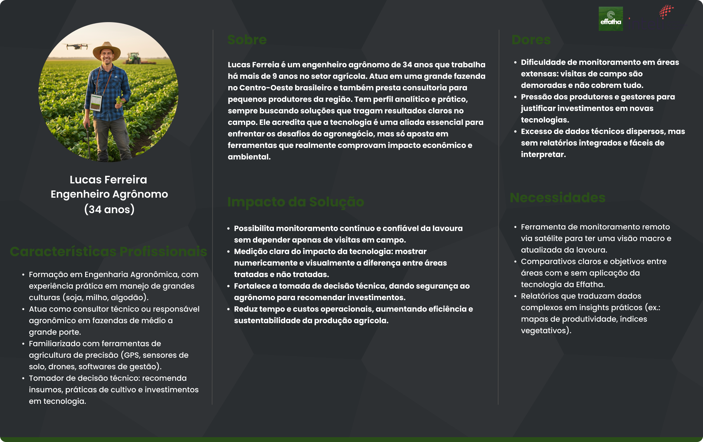

# Persona

## Introdução

&emsp; Nesta seção, foram elaboradas as personas do projeto para um melhor entendimento das dores, necessidades e desejos dos futuros usuários da solução. A persona escolhida pela equipe como a principal usuário da solução, com base nas conversas com o parceiro, foi o Engenheiro Agrônomo que será responsável pela adoção e utilização da aplicação desenvolvida.

### Persona 01 : Lucas Ferreira

&emsp; Foi criada uma persona para representar o perfil de Engenheiro Agrônomo, profissional que desempenha papel central na adoção e utilização da tecnologia proposta.

  Figura 01: Persona Lucas Ferreira - Engenheiro Agrônomo 

 Fonte: Autoral, 2025 
  

**Sobre:** Lucas Ferreia é um engenheiro agrônomo de 34 anos que trabalha há mais de 9 anos no setor agrícola. Atua em uma grande fazenda no Centro-Oeste brasileiro e também presta consultoria para pequenos produtores da região. Tem perfil analítico e prático, sempre buscando soluções que tragam resultados claros no campo. Ele acredita que a tecnologia é uma aliada essencial para enfrentar os desafios do agronegócio, mas só aposta em ferramentas que realmente comprovam impacto econômico e ambiental.

**Características Profissionais:**

* Formação em Engenharia Agronômica, com experiência prática em manejo de grandes culturas (soja, milho, algodão).
* Atua como consultor técnico ou responsável agronômico em fazendas de médio a grande porte.
* Familiarizado com ferramentas de agricultura de precisão (GPS, sensores de solo, drones, softwares de gestão).
* Tomador de decisão técnico: recomenda insumos, práticas de cultivo e investimentos em tecnologia.

**Dores:**

* Dificuldade de monitoramento em áreas extensas: visitas de campo são demoradas e não cobrem tudo.
* Pressão dos produtores e gestores para justificar investimentos em novas tecnologias.
* Excesso de dados técnicos dispersos, mas sem relatórios integrados e fáceis de interpretar.

**Necessidades:**

* Ferramenta de monitoramento remoto via satélite para ter uma visão macro e atualizada da lavoura.
* Comparativos claros e objetivos entre áreas com e sem aplicação da tecnologia da Effatha.
* Relatórios que traduzam dados complexos em insights práticos (ex.: mapas de produtividade, índices vegetativos).

**Impacto da Solução:**

* Possibilita monitoramento contínuo e confiável da lavoura sem depender apenas de visitas em campo.
* Medição clara do impacto da tecnologia: mostrar numericamente e visualmente a diferença entre áreas tratadas e não tratadas.
* Fortalece a tomada de decisão técnica, dando segurança ao agrônomo para recomendar investimentos.
* Reduz tempo e custos operacionais, aumentando eficiência e sustentabilidade da produção agrícola.

&emsp; A construção da persona Lucas Ferreira, engenheiro agrônomo permitiu compreender de forma clara o objetivo da Effatha e como sua solução gera valor no campo, representando um profissional experiente em grandes culturas, responsável por decisões estratégicas sobre produtividade e custos. Esse perfil evidenciou suas dores, como a dificuldade de monitorar áreas extensas, a demora em identificar problemas, a falta de métricas comparativas confiáveis e suas necessidades, como ferramentas de monitoramento remoto, relatórios claros e evidências que traduzam dados em recomendações práticas. Nesse contexto, a solução da Effatha se mostra essencial ao oferecer mensuração precisa por imagens de satélite, comparando áreas com e sem tecnologia aplicada, antecipando problemas e fortalecendo a tomada de decisão técnica, garantindo eficiência, sustentabilidade e maior credibilidade ao trabalho do agrônomo.
