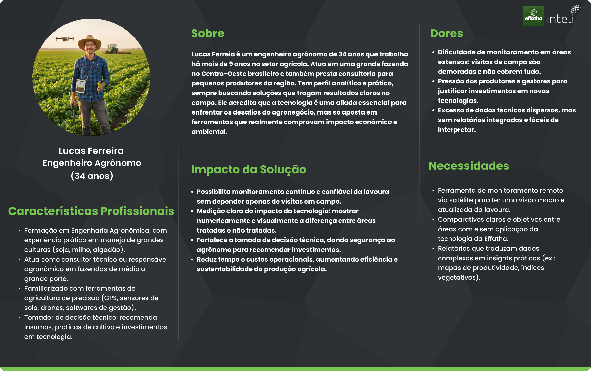

# Jornada do Usuário

## Introdução

&emsp; Nesta seção, foi elaborada a jornada do usuário para compreender em detalhes como se dará a interação com a aplicação proposta. A partir do perfil da persona principal,o engenheiro agrônomo responsável por validar e adotar a tecnologia, estruturou-se o caminho percorrido dentro da solução, desde o primeiro contato até a geração de relatórios finais.

&emsp; O objetivo é entender não apenas as ações realizadas, mas também os objetivos, pensamentos, dores e emoções vivenciados em cada etapa. Com o objetivo de projetar a entrega de maior valor para o usuário.

### Jornada do Usuário: Engenheiro Agrônomo

&emsp; A seguir, estão descritos os quatro principais estágios da jornada, acompanhados dos elementos que orientam a experiência do usuário.

**Figura 01 – Jornada do usuário Lucas Ferreira - Engenheiro Agrônomo**

Fonte: Autoral, 2025

### Estágio 01: Selecionar a área de interesse

**Objetivo:** Definir claramente qual área agrícola será analisada.

**Ações:** Navega no mapa interativo, delimita a área com ferramentas de seleção e confirma a escolha.

**Pensamentos:** “Preciso garantir que estou selecionando exatamente a área correta.”

**Dores:** Insegurança sobre a precisão do mapa, dificuldade em identificar limites exatos da propriedade.

**Emoções:** Curiosidade e leve ansiedade por estar iniciando a análise.

### Estágio 02: Comparar o desenvolvimento histórico

**Objetivo:** Avaliar se a área com a tecnologia aplicada apresenta diferença em relação ao histórico ou a áreas de controle.

**Ações:** Seleciona datas passadas, aplica filtros, compara visualmente os resultados entre áreas.

**Pensamentos:** “Será que consigo visualizar claramente o impacto da tecnologia?”

**Dores:** Carregamento lento das imagens, confusão ao escolher períodos de comparação, dificuldade em interpretar pequenas diferenças.

**Emoções:** Expectativa e foco nos detalhes, mas com risco de frustração se a análise não ficar clara.

### Estágio 03: Visualizar métricas geradas automaticamente

**Objetivo:** Obter dados concretos que traduzam a análise visual em números confiáveis.

**Ações:** Explora dashboards com índices de vegetação, gráficos temporais e mapas de calor.

**Pensamentos:** “Esses números realmente mostram a diferença? Dá para confiar nesses indicadores?”

**Dores:** Excesso de informações técnicas, dificuldade em interpretar indicadores muito complexos.

**Emoções:** Confiança quando os dados confirmam hipóteses; insegurança caso os gráficos pareçam difíceis de compreender.

### Estágio 04: Gerar relatórios personalizados

**Objetivo:** Criar materiais claros e persuasivos para compartilhar com investidores e parceiros.

**Ações:** Seleciona métricas relevantes, organiza informações e exporta relatórios em formatos como PDF ou PowerPoint.

**Pensamentos:** “Esse relatório mostra de forma convincente o valor da tecnologia?”

**Dores:** Preocupação com o design e clareza do relatório; dificuldade em adaptar para diferentes públicos (técnico x investidor).

**Emoções:** Satisfação e orgulho quando o relatório é impactante; alívio por ter material pronto para apresentação.

&emsp; A construção da jornada do usuário permite visualizar de forma clara como o engenheiro agrônomo interage com a aplicação em cada fase, evidenciando suas necessidades e pontos de atenção. Dessa forma, a solução proposta se mostra uma ferramenta prática e confiável capaz de aumentanr a confiança na tomada de decisão baseada em dados de imagens de satélite.

