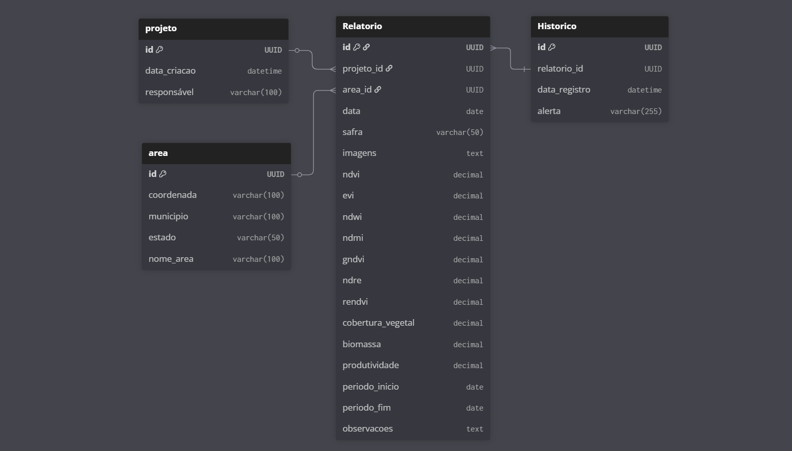

# Modelagem de Banco de Dados - Effatha

## Visão Geral

Este documento apresenta a modelagem do banco de dados para o sistema Effatha, uma plataforma de monitoramento agrícola via análise de imagens de satélite. O modelo foi desenvolvido para suportar as funcionalidades principais do MVP, incluindo gestão de usuários, análise de áreas agrícolas, geração de relatórios com índices de vegetação e manutenção de histórico de análises.

## Diagrama de Entidade-Relacionamento



## Estrutura das Tabelas

### 1. Tabela LOGIN

Armazena informações dos usuários do sistema, incluindo credenciais de acesso e dados de contato.

| Campo | Tipo | Restrições | Descrição |
|-------|------|------------|-----------|
| `id` | INTEGER | PRIMARY KEY | Identificador único do usuário |
| `nome` | VARCHAR(100) | NOT NULL | Nome completo do usuário |
| `senha` | VARCHAR(255) | NOT NULL | Hash da senha criptografada |
| `email` | VARCHAR(150) | UNIQUE, NOT NULL | E-mail de login (único no sistema) |
| `telefone` | VARCHAR(20) | - | Número de contato |
| `data_criacao` | DATETIME | DEFAULT CURRENT_TIMESTAMP | Data e hora do registro do usuário |

**Índices:**
- `idx_login_email` em `email` para otimização de consultas de autenticação

### 2. Tabela AREA

Gerencia as propriedades rurais e áreas de interesse para análise.

| Campo | Tipo | Restrições | Descrição |
|-------|------|------------|-----------|
| `id` | INTEGER | PRIMARY KEY, AUTO_INCREMENT | Identificador único da área |
| `coordenada` | VARCHAR(100) | NOT NULL | Coordenadas geográficas da propriedade |
| `municipio` | VARCHAR(100) | NOT NULL | Município de localização |
| `estado` | VARCHAR(50) | NOT NULL | Estado (UF) |
| `nome_area` | VARCHAR(100) | NOT NULL | Nome da propriedade ou identificação |

**Índices:**
- `idx_area_municipio_estado` em `(municipio, estado)` para buscas por localização

### 3. Tabela RELATORIO

Tabela central que armazena os resultados das análises de imagens satelitais e índices de vegetação calculados.

| Campo | Tipo | Restrições | Descrição |
|-------|------|------------|-----------|
| `id` | INTEGER | PRIMARY KEY | Identificador único do relatório |
| `area_id` | INTEGER | FOREIGN KEY → Area(id) | Referência à área analisada |
| `usuario_id` | INTEGER | FOREIGN KEY → Login(id) | Referência ao usuário proprietário |
| `data` | DATE | NOT NULL | Data da análise |
| `safra` | VARCHAR(50) | - | Identificação da safra (ex: "Soja 2024/25") |
| `imagens` | TEXT | - | Caminho/URL das imagens processadas |
| `ndvi` | DECIMAL(10,6) | - | Índice NDVI (Normalized Difference Vegetation Index) |
| `evi` | DECIMAL(10,6) | - | Índice EVI (Enhanced Vegetation Index) |
| `ndwi` | DECIMAL(10,6) | - | Índice NDWI (Normalized Difference Water Index) |
| `ndmi` | DECIMAL(10,6) | - | Índice NDMI (Normalized Difference Moisture Index) |
| `gndvi` | DECIMAL(10,6) | - | Índice GNDVI (Green NDVI) |
| `ndre` | DECIMAL(10,6) | - | Índice NDRE (Normalized Difference Red Edge) |
| `rendvi` | DECIMAL(10,6) | - | Índice RENDVI (Red Edge NDVI) |
| `cobertura_vegetal` | DECIMAL(5,2) | - | Percentual de cobertura vegetal |
| `biomassa` | DECIMAL(10,2) | - | Biomassa estimada (ton/ha) |
| `produtividade` | DECIMAL(10,2) | - | Produtividade potencial estimada |
| `periodo_inicio` | DATE | NOT NULL | Data inicial do período de análise |
| `periodo_fim` | DATE | NOT NULL | Data final do período de análise |
| `observacoes` | TEXT | - | Campo livre para anotações do usuário |

**Índices:**
- `idx_relatorio_area_id` em `area_id`
- `idx_relatorio_usuario_id` em `usuario_id`
- `idx_relatorio_data` em `data`
- `idx_relatorio_periodo` em `(periodo_inicio, periodo_fim)`

### 4. Tabela HISTORICO

Registra eventos importantes, alertas e anomalias detectadas nas análises.

| Campo | Tipo | Restrições | Descrição |
|-------|------|------------|-----------|
| `id` | INTEGER | PRIMARY KEY | Identificador único do registro |
| `relatorio_id` | INTEGER | FOREIGN KEY → Relatorio(id) | Referência ao relatório relacionado |
| `data_registro` | DATETIME | DEFAULT CURRENT_TIMESTAMP | Data e hora do registro |
| `alerta` | VARCHAR(255) | - | Descrição da anomalia ou tendência detectada |

**Índices:**
- `idx_historico_relatorio_id` em `relatorio_id`
- `idx_historico_data_registro` em `data_registro`

## Relacionamentos

### Cardinalidade

- **Projeto → Relatório**: Um para Muitos (1:N)
  - Um projeto pode ter múltiplos relatórios
  
- **Área → Relatório**: Um para Muitos (1:N)
  - Uma área pode ter múltiplas análises ao longo do tempo
  
- **Relatório → Histórico**: Um para Muitos (1:N)
  - Um relatório pode ter múltiplos registros de histórico

### Integridade Referencial

- `CASCADE DELETE` em Histórico quando Relatório é removido
- `RESTRICT DELETE` em Login e Área quando existem relatórios associados

## Script de Criação (SQL)

```sql
-- Tabela PROJETO
CREATE TABLE projeto (
    id SERIAL PRIMARY KEY,
    responsavel VARCHAR(100) NOT NULL,
    data_criacao TIMESTAMP DEFAULT CURRENT_TIMESTAMP
);

-- Tabela AREA
CREATE TABLE area (
    id SERIAL PRIMARY KEY,
    coordenada VARCHAR(100) NOT NULL,
    municipio VARCHAR(100) NOT NULL,
    estado VARCHAR(50) NOT NULL,
    nome_area VARCHAR(100) NOT NULL
);

-- Tabela RELATORIO
CREATE TABLE relatorio (
    id SERIAL PRIMARY KEY,
    area_id INTEGER NOT NULL,
    projeto_id INTEGER NOT NULL,
    data DATE NOT NULL,
    safra VARCHAR(50),
    imagens TEXT,
    ndvi DECIMAL(10,6),
    evi DECIMAL(10,6),
    ndwi DECIMAL(10,6),
    ndmi DECIMAL(10,6),
    gndvi DECIMAL(10,6),
    ndre DECIMAL(10,6),
    rendvi DECIMAL(10,6),
    cobertura_vegetal DECIMAL(5,2),
    biomassa DECIMAL(10,2),
    produtividade DECIMAL(10,2),
    periodo_inicio DATE NOT NULL,
    periodo_fim DATE NOT NULL,
    observacoes TEXT,
    CONSTRAINT fk_area FOREIGN KEY (area_id) 
        REFERENCES area(id) ON DELETE RESTRICT,
    CONSTRAINT fk_projeto FOREIGN KEY (projeto_id) 
        REFERENCES projeto(id) ON DELETE RESTRICT
);

-- Tabela HISTORICO
CREATE TABLE historico (
    id SERIAL PRIMARY KEY,
    relatorio_id INTEGER NOT NULL,
    data_registro TIMESTAMP DEFAULT CURRENT_TIMESTAMP,
    alerta VARCHAR(255),
    CONSTRAINT fk_relatorio FOREIGN KEY (relatorio_id) 
        REFERENCES relatorio(id) ON DELETE CASCADE
);

-- Criação de índices
CREATE INDEX idx_login_email ON login(email);
CREATE INDEX idx_area_municipio_estado ON area(municipio, estado);
CREATE INDEX idx_relatorio_area_id ON relatorio(area_id);
CREATE INDEX idx_relatorio_usuario_id ON relatorio(usuario_id);
CREATE INDEX idx_relatorio_data ON relatorio(data);
CREATE INDEX idx_relatorio_periodo ON relatorio(periodo_inicio, periodo_fim);
CREATE INDEX idx_historico_relatorio_id ON historico(relatorio_id);
CREATE INDEX idx_historico_data_registro ON historico(data_registro);
```

## Segurança

### Medidas Implementadas

- **Senhas Criptografadas**: Campo `senha` armazena apenas hash
- **Email Único**: Previne duplicação de contas

## Integração com a Aplicação

### Compatibilidade

Este modelo está alinhado com:
- Requisitos funcionais do MVP (RF041-RF091)
- Requisitos não-funcionais de performance (RNF031-RNF048)
- Arquitetura técnica descrita na documentação do projeto

## Conclusão

Esta modelagem de banco de dados fornece uma base sólida para o sistema criado para o case Effatha, suportando todas as funcionalidades essenciais do MVP enquanto mantém flexibilidade para evolução futura.