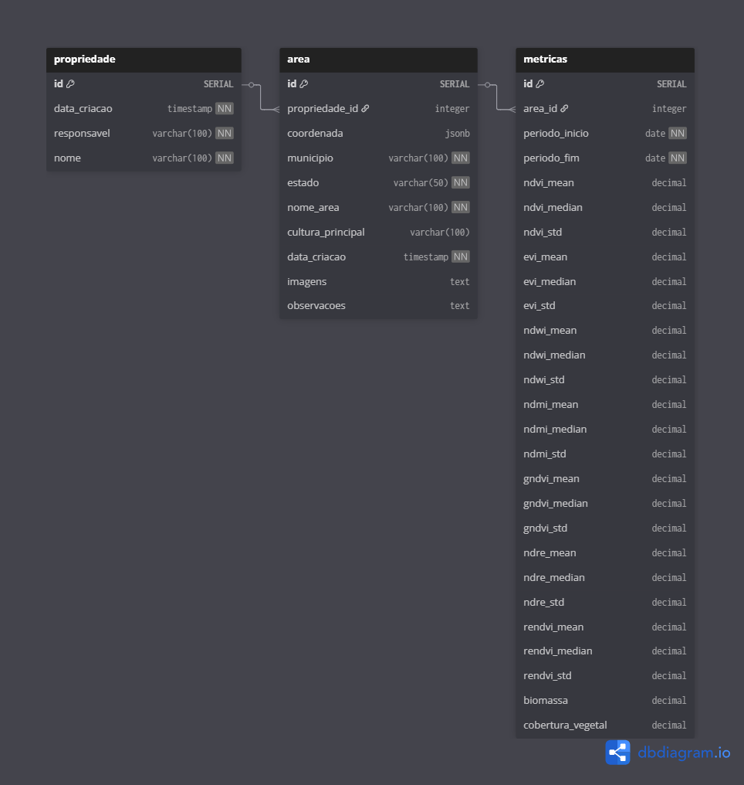

# Modelagem de Banco de Dados - Effatha

## Visão Geral

Este documento apresenta a modelagem do banco de dados para o sistema Effatha, uma plataforma de monitoramento agrícola via análise de imagens de satélite. O modelo foi desenvolvido para suportar as funcionalidades principais do MVP, incluindo gestão de projetos, análise de áreas agrícolas, geração de relatórios com índices de vegetação e manutenção de histórico de análises.

## Diagrama de Entidade-Relacionamento



## Estrutura das Tabelas

### 1. Tabela PROJETO

Armazena informações dos projetos de monitoramento agrícola.

| Campo | Tipo | Restrições | Descrição |
|-------|------|------------|-----------|
| `id` | UUID | PRIMARY KEY | Identificador único do projeto |
| `nome` | VARCHAR(150) | NOT NULL | Nome do projeto |
| `data_criacao` | DATETIME | NOT NULL | Data e hora de criação do projeto |
| `responsavel` | VARCHAR(100) | NOT NULL | Nome do responsável pelo projeto |

**Índices:**

- `idx_projeto_nome` em `nome` para buscas por nome do projeto
- `idx_projeto_responsavel` em `responsavel` para buscas por responsável
- `idx_projeto_data_criacao` em `data_criacao` para ordenação temporal

### 2. Tabela AREA

Gerencia as propriedades rurais e áreas de interesse para análise.

| Campo | Tipo | Restrições | Descrição |
|-------|------|------------|-----------|
| `id` | UUID | PRIMARY KEY | Identificador único da área |
| `coordenada` | JSONB | NOT NULL | Coordenadas geográficas da propriedade |
| `municipio` | VARCHAR(100) | NOT NULL | Município de localização |
| `estado` | VARCHAR(50) | NOT NULL | Estado (UF) |
| `nome_area` | VARCHAR(100) | NOT NULL | Nome da propriedade ou identificação |
| `cultura predominante` | VARCHAR(100) | NOT NULL | Nome da cultura principal |

**Índices:**

- `idx_area_municipio_estado` em `(municipio, estado)` para buscas por localização
- `idx_area_nome` em `nome_area` para buscas por nome

### 3. Tabela RELATORIO

Tabela central que armazena os resultados das análises de imagens satelitais e índices de vegetação calculados.

| Campo | Tipo | Restrições | Descrição |
|-------|------|------------|-----------|
| `id` | UUID | PRIMARY KEY | Identificador único do relatório |
| `projeto_id` | UUID | FOREIGN KEY → Projeto(id) | Referência ao projeto |
| `area_id` | UUID | FOREIGN KEY → Area(id) | Referência à área analisada |
| `data` | DATE | NOT NULL | Data da análise |
| `safra` | VARCHAR(50) | - | Identificação da safra (ex: "Soja 2024/25") |
| `imagens` | TEXT | - | Caminho/URL das imagens processadas |
| `ndvi` | DECIMAL(10,6) | - | Índice NDVI (Normalized Difference Vegetation Index) |
| `evi` | DECIMAL(10,6) | - | Índice EVI (Enhanced Vegetation Index) |
| `ndwi` | DECIMAL(10,6) | - | Índice NDWI (Normalized Difference Water Index) |
| `ndmi` | DECIMAL(10,6) | - | Índice NDMI (Normalized Difference Moisture Index) |
| `gndvi` | DECIMAL(10,6) | - | Índice GNDVI (Green NDVI) |
| `ndre` | DECIMAL(10,6) | - | Índice NDRE (Normalized Difference Red Edge) |
| `rendvi` | DECIMAL(10,6) | - | Índice RENDVI (Red Edge NDVI) |
| `cobertura_vegetal` | DECIMAL(5,2) | - | Percentual de cobertura vegetal |
| `biomassa` | DECIMAL(10,2) | - | Biomassa estimada (ton/ha) |
| `periodo_inicio` | DATE | NOT NULL | Data inicial do período de análise |
| `periodo_fim` | DATE | NOT NULL | Data final do período de análise |
| `observacoes` | TEXT | - | Campo livre para anotações do usuário |

**Índices:**

- `idx_relatorio_projeto_id` em `projeto_id`
- `idx_relatorio_area_id` em `area_id`
- `idx_relatorio_data` em `data`
- `idx_relatorio_periodo` em `(periodo_inicio, periodo_fim)`

### 4. Tabela HISTORICO

Registra eventos importantes, alertas e anomalias detectadas nas análises.

| Campo | Tipo | Restrições | Descrição |
|-------|------|------------|-----------|
| `id` | UUID | PRIMARY KEY | Identificador único do registro |
| `relatorio_id` | UUID | FOREIGN KEY → Relatorio(id) | Referência ao relatório relacionado |
| `data_registro` | DATETIME | DEFAULT CURRENT_TIMESTAMP | Data e hora do registro |
| `alerta` | VARCHAR(255) | - | Descrição da anomalia ou tendência detectada |

**Índices:**

- `idx_historico_relatorio_id` em `relatorio_id`
- `idx_historico_data_registro` em `data_registro`

## Relacionamentos

### Cardinalidade

- **Projeto → Relatório**: Um para Muitos (1:N)
  - Um projeto pode ter múltiplos relatórios de análise
  
- **Área → Relatório**: Um para Muitos (1:N)
  - Uma área pode ter múltiplas análises ao longo do tempo
  
- **Relatório → Histórico**: Um para Muitos (1:N)
  - Um relatório pode ter múltiplos registros de histórico e alertas

### Integridade Referencial

- `CASCADE DELETE` em Histórico quando Relatório é removido
- `RESTRICT DELETE` em Projeto e Área quando existem relatórios associados

## Script de Criação (SQL)

```sql
-- Extensão para UUID
CREATE EXTENSION IF NOT EXISTS "uuid-ossp";

-- Tabela PROJETO
CREATE TABLE projeto (
    id UUID PRIMARY KEY DEFAULT uuid_generate_v4(),
    nome VARCHAR(150) NOT NULL,
    data_criacao TIMESTAMP NOT NULL DEFAULT CURRENT_TIMESTAMP,
    responsavel VARCHAR(100) NOT NULL
);

-- Tabela AREA
CREATE TABLE area (
    id UUID PRIMARY KEY DEFAULT uuid_generate_v4(),
    coordenada VARCHAR(100) NOT NULL,
    municipio VARCHAR(100) NOT NULL,
    estado VARCHAR(50) NOT NULL,
    nome_area VARCHAR(100) NOT NULL
);

-- Tabela RELATORIO
CREATE TABLE relatorio (
    id UUID PRIMARY KEY DEFAULT uuid_generate_v4(),
    projeto_id UUID NOT NULL,
    area_id UUID NOT NULL,
    data DATE NOT NULL,
    safra VARCHAR(50),
    imagens TEXT,
    ndvi DECIMAL(10,6),
    evi DECIMAL(10,6),
    ndwi DECIMAL(10,6),
    ndmi DECIMAL(10,6),
    gndvi DECIMAL(10,6),
    ndre DECIMAL(10,6),
    rendvi DECIMAL(10,6),
    cobertura_vegetal DECIMAL(5,2),
    biomassa DECIMAL(10,2),
    produtividade DECIMAL(10,2),
    periodo_inicio DATE NOT NULL,
    periodo_fim DATE NOT NULL,
    observacoes TEXT,
    CONSTRAINT fk_relatorio_projeto FOREIGN KEY (projeto_id) 
        REFERENCES projeto(id) ON DELETE RESTRICT,
    CONSTRAINT fk_relatorio_area FOREIGN KEY (area_id) 
        REFERENCES area(id) ON DELETE RESTRICT
);

-- Tabela HISTORICO
CREATE TABLE historico (
    id UUID PRIMARY KEY DEFAULT uuid_generate_v4(),
    relatorio_id UUID NOT NULL,
    data_registro TIMESTAMP DEFAULT CURRENT_TIMESTAMP,
    alerta VARCHAR(255),
    CONSTRAINT fk_historico_relatorio FOREIGN KEY (relatorio_id) 
        REFERENCES relatorio(id) ON DELETE CASCADE
);

-- Criação de índices
CREATE INDEX idx_projeto_nome ON projeto(nome);
CREATE INDEX idx_projeto_responsavel ON projeto(responsavel);
CREATE INDEX idx_projeto_data_criacao ON projeto(data_criacao);
CREATE INDEX idx_area_municipio_estado ON area(municipio, estado);
CREATE INDEX idx_area_nome ON area(nome_area);
CREATE INDEX idx_relatorio_projeto_id ON relatorio(projeto_id);
CREATE INDEX idx_relatorio_area_id ON relatorio(area_id);
CREATE INDEX idx_relatorio_data ON relatorio(data);
CREATE INDEX idx_relatorio_periodo ON relatorio(periodo_inicio, periodo_fim);
CREATE INDEX idx_historico_relatorio_id ON historico(relatorio_id);
CREATE INDEX idx_historico_data_registro ON historico(data_registro);

-- Comentários nas tabelas
COMMENT ON TABLE projeto IS 'Tabela que armazena informações dos projetos de monitoramento agrícola';
COMMENT ON TABLE area IS 'Tabela que gerencia as propriedades rurais e áreas de interesse para análise';
COMMENT ON TABLE relatorio IS 'Tabela central que armazena os resultados das análises de imagens satelitais';
COMMENT ON TABLE historico IS 'Tabela que registra eventos importantes, alertas e anomalias detectadas';
```

## Considerações de Design

### Uso de UUID

A adoção de UUID como chave primária oferece vantagens importantes:

- Identificadores únicos globalmente, facilitando distribuição e replicação
- Evita problemas de colisão em ambientes distribuídos
- Maior segurança ao não expor informações sobre o volume de dados

### Índices Estratégicos

Os índices foram projetados considerando os padrões de consulta mais frequentes:

- Busca de relatórios por projeto e área
- Filtros por período temporal
- Consultas de histórico por relatório

### Flexibilidade dos Dados

O modelo permite extensibilidade futura através de:

- Campo `observacoes` em formato TEXT para dados não estruturados
- Múltiplos índices de vegetação para diferentes tipos de análise
- Estrutura de histórico para auditoria e rastreamento

## Integração com a Aplicação

### Compatibilidade

Este modelo está alinhado com:

- Requisitos funcionais do MVP (RF041-RF091)
- Requisitos não-funcionais de performance (RNF031-RNF048)
- Arquitetura técnica descrita na documentação do projeto

### Performance

As consultas mais frequentes foram otimizadas através de:

- Índices compostos para queries com múltiplos filtros
- Particionamento temporal implícito através dos índices de data
- Normalização adequada evitando redundância desnecessária

## Conclusão

Esta modelagem de banco de dados fornece uma base sólida e escalável para o sistema Effatha, suportando todas as funcionalidades essenciais do MVP enquanto mantém flexibilidade para evolução futura. A estrutura está preparada para atender aos requisitos de performance e crescimento esperados do sistema.
