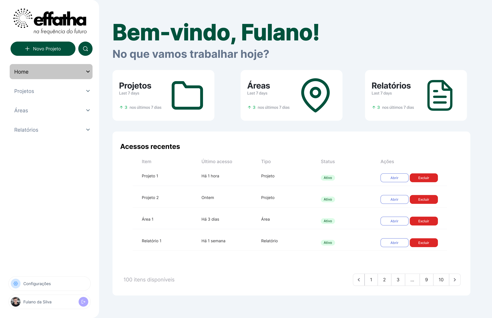

# Protótipo Front-End

O objetivo deste documento é apresentar a proposta de front‑end a partir de um protótipo de alta fidelidade para a interface do sistema. Cada seção referencia diretamente uma tela proposta e explica, de forma simples, os elementos visuais, controles e comportamentos observados com o intuito de facilitar a implementação da interface.

## Resumo das páginas

- **Home (Painel Principal):** painel de boas‑vindas com acesso rápido às principais áreas do sistema (Projetos, Áreas, Relatórios), cartões de atalho para métricas recentes e uma tabela de acessos que apresenta itens usados recentemente com ações rápidas (Abrir / Excluir). Serve como ponto de partida e visão situacional do usuário.

- **Projetos:** listagem e gerenciamento de projetos com busca, botão para criar novo projeto, e uma tabela que mostra nome, último acesso, data de criação, status e ações. Destinada à organização de conjuntos de áreas e ao controle administrativo.

- **Áreas:** listagem de parcelas monitoradas com campo de busca, botão para adicionar nova área e uma tabela com colunas (Nome, Estado, Município, Cultura predominante, Status, Ações). Permite seleção e atualização rápida de cada área.

- **Adicionar Nova Área (Modal/Assistente):** modal com mapa central para delimitação, painel lateral direito com “Informações iniciais” (Estado, Município, Cultura principal) e botões de ação (Cancelar / Adicionar). Destinado ao cadastramento guiado de novas parcelas.

- **Relatórios:** página de gerenciamento de relatórios com busca, botão para criar novo relatório, e tabela que lista relatórios prontos com Datas de emissão, Projetos e Áreas associadas; inclui ações para visualizar e excluir.

- **Exemplo de Relatório (Visualização):** visualização de um relatório gerado contendo cartões de métricas por fazenda, gráficos de série temporal por índice (NDVI, SAVI, Biomass, EVI) e um gráfico comparativo entre áreas. Serve como padrão de saída para exports e apresentações.

## Descrição das páginas

### Home

A tela de entrada abre com uma mensagem de boas-vindas, tendo logo abaixo três cartões de atalho com ícones grandes e o título de cada área funcional, "Projetos", "Áreas" e "Relatórios", trazendo também uma métrica resumida (ex.: crescimento nos últimos 7 dias). Esses cartões funcionam como atalhos para os respectivos módulos e também indicam KPI rápidos.

No corpo principal existe uma seção "Acessos recentes" em formato de tabela com colunas: Item, Último acesso, Tipo, Status e Ações. Cada linha exibe botões de ação: um botão de contorno "Abrir" e um botão vermelho "Excluir". A presença de paginação no rodapé confirma suporte a grandes volumes de itens. Na coluna lateral esquerda, um menu persistente com logo, botão "+ Novo Projeto" e ícones de busca e perfil permite navegação consistente. Este layout serve tanto para usuários administrativos quanto operacionais, priorizando descoberta rápida e retomada de atividades.

### Projetos

A página de Projetos mantém o mesmo cabeçalho e barra lateral. O conteúdo principal começa com um campo de busca com placeholder "Pesquisar por projetos" e um botão de ação verde "Criar novo projeto". Abaixo há um card grande contendo a tabela "Projetos disponíveis" com colunas: Nome, Último acesso, Data de criação, Status e Ações. As ações por linha reproduzem o padrão (Abrir / Excluir). A tabela mostra um design limpo com linhas espaçadas e badges de estado verdes indicando "Ativo". A paginação no canto inferior direito sinaliza que a página suporta navegação por múltiplas páginas de resultados.

Funcionalidade implícita: filtros por status ou data de criação podem ser ativados a partir dessa interface; o botão de criação deve abrir um modal ou rota para cadastro com validações de front‑end.

### Áreas

Na página Áreas, a pesquisa é central (placeholder "Pesquisar por áreas") e existe um botão para "Adicionar nova área" posicionado logo abaixo da busca. A tabela principal lista as áreas com colunas nome, estado, município, cultura predominante, status e ações. Cada linha permite "Atualizar" (abre formulário/editar) e "Excluir". As badges de status aparecem como pílulas verdes "Ativa".

Observações de usabilidade: os mini‑mapas ausentes indicam que a visualização espacial da parcela pode ser acessada via ação de abrir, mas é recomendável adicionar um ícone de pré‑visualização do polígono diretamente na lista para acelerar a inspeção.

### Adicionar nova Área

O modal de criação de área aparece como um diálogo centralizado de grande dimensão. Do lado esquerdo há um mapa com instruções superiores "Selecione a área de interesse". À direita, um painel "Informações iniciais" exibe campos de formulário: Estado (dropdown com "São Paulo" selecionado), Município (dropdown com placeholder), Cultura principal (dropdown opcional com "Soja" selecionado). Na parte inferior do modal estão dois botões: um de contorno "Cancelar" e um botão primário verde "Adicionar nova área".

A ideia é habilitar uma opção para desenho de polígono com ferramentas de edição (add vertex / delete vertex), fornecendo feedback em tempo real do cálculo de área (hectares) e validar CRS do upload. O modal deve permitir upload de shapefile/KML como alternativa ao desenho manual e mostrar preview imediato do polígono no mapa.

### Relatórios

A página de Relatórios segue o mesmo padrão de busca e botão de criação "Criar novo relatório". A tabela "Relatórios disponíveis" traz colunas: Relatório, Data de emissão, Projeto associado, Área(s) associada(s) e Ações. Cada linha possui um botão "Visualizar" (contorno) e um botão vermelho "Excluir". A paginação e o rodapé com contagem total confirmam suporte a histórico grande de relatórios.

Fluxo implícito: o botão de criar deve abrir um compositor de relatório onde o usuário seleciona template, período, métricas e logo; o botão "Visualizar" deve abrir a pré‑visualização com opção de exportar PDF/CSV.

### Exemplo de Relatório

A visualização de um relatório gerado apresenta várias áreas de informação: no topo o título "Relatório 1", abaixo cartões com métricas por fazenda (títulos: "Variáveis básicas Fazenda 1" e "Variáveis básicas Fazenda 2") contendo abas de índices (NDVI, SAVI, Biomass, EVI) e um gráfico de linha mostrando a série temporal dos últimos 7 dias. Abaixo dos cartões há um gráfico maior "Comparativo das áreas" que sobrepõe duas séries (cores distintas) permitindo comparação direta entre parcelas.

Recomendações de padronização: os cartões de métrica devem permitir exportação individual (PNG/PDF) e o comparativo deve oferecer legenda interativa (hover para mostrar valores por data). As unidades e escalas devem constar em cada cartão para evitar ambiguidade (ex.: "Tonelada/Hectare" para Biomass).
